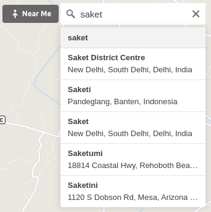
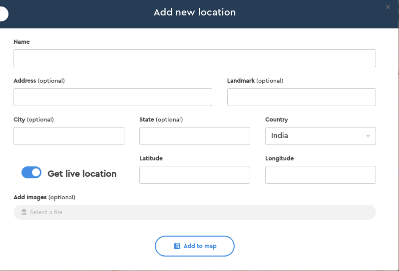
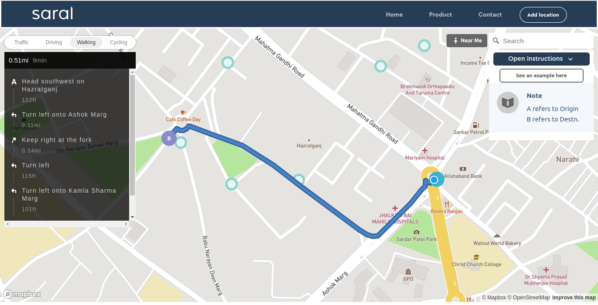

<p align="center">
  <a href="https://neeleshbisht99.github.io/Saral-interface/">
    
  </a>
</p>

> saral is a web based social awareness platform where users can identify nearest trash-bins around them.
>
> Born out of the need/problem in India to identify trashbins in a unknown place, with a mission to spread cleanliness.
>
> Utilizing technology for social good.
>
> :computer: Built on [React](http://facebook.github.io/react/) and [react-map-gl](https://github.com/visgl/react-map-gl).

## :rocket: See it <a href="https://neeleshbisht99.github.io/Saral-interface/">live</a> here.

## Table of Contents

- [Installation](#installation)
- [Features](#features)
- [Example](#example)
- [Support](#support)

## Installation

```sh
 git clone https://github.com/neeleshbisht99/react-map-gl-directions.git

 cd Saral-interface && npm install
```

## Features

- Navigate around your location and to any other place around the globe using the finder.
  

- Add location of the trash-bin you are familiar with.
  

- It creates a path from your location to the destination along with step by step instructions.
  

- Creates shortest path for you in following ways :
  - Driving
  - walking
  - Cycling
  - Traffic

## Example


## Support

Reach out to me at one of the following places!

- Linkedin at <a href="https://www.linkedin.com/in/neelesh-bisht-398061b4/" target="_blank">`Neelesh Bisht`</a>
- Mail at <a href="mailto:neelesbisht99@gmail.com" target="_blank">`neeleshbisht99@gmail.com`</a>
- Twitter at <a href="https://twitter.com/neeleshbisht99" target="_blank">`@neeleshbisht99`</a>
